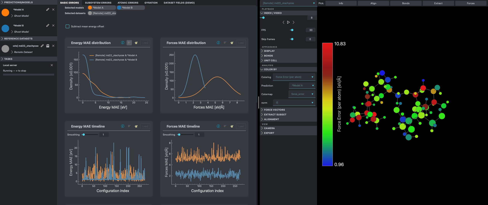

# FFAST

[](https://github.com/TCPUniLU/FFAST/actions/workflows/tests.yml)
[](https://www.python.org/downloads/release/python-3110/)
[](LICENSE)

**Force Field Analysis and Screening Tool** — find out where your machine-learned
force field is wrong, and what the molecule was doing when it went wrong.

You point FFAST at a dataset and a set of predictions. It shows you the error
along the trajectory, the error distributions, and per-element and per-structure
breakdowns. When a plot shows something odd, you select that region and the
offending configurations open in a 3D viewer, force vectors and all. That loop —
spot it in a plot, look at it in 3D — is the whole point of the tool.

The compute half runs wherever your data is, which for most people means an HPC
cluster: FFAST will submit the SLURM job and install itself there on first
connect, and only the configurations you select come back to your machine.

There are two clients, and they speak the same protocol to the same server.
`ffast` starts the desktop one, which is the complete one. Where Qt cannot be
installed — a cluster login node, a container — the same command starts the
browser client instead, which needs no native GL or Qt libraries but is younger
and does not cover everything the desktop does yet. See
[Two clients](#two-clients).



*Here to read the code rather than run it?* Start with
[docs/architecture.md](docs/architecture.md) and the
[54 ADRs](docs/adr/README.md); [If you came to read the
code](#if-you-came-to-read-the-code) says which ones are worth your time.

## Why it exists

Force-field papers report a single MAE. That number tells you almost nothing
about whether a model is usable: two models with the same MAE can fail in
completely different places, one of them harmless and one of them exactly on the
transition state you care about. Aggregate metrics hide this by construction.

FFAST is built on the assumption that you want to see the distribution and then
go look at the outliers, and that the data is too big to move. Everything else
follows from those two things.

## Install

Python 3.11, exactly. Nothing else is supported, because at least one ML backend
breaks on anything newer.

```bash
git clone https://github.com/TCPUniLU/FFAST.git
cd FFAST
python3.11 -m venv .venv && source .venv/bin/activate
pip install -e ".[gui]"
```

The `gui` extra pulls PySide6 and vispy, which the desktop client needs. Leave it
off and you still get the browser client, the server and the CLI with no native
libraries at all — that is the install to use on a cluster login node, where a
Qt/OpenGL stack is a fight you don't want:

```bash
pip install -e .                 # server + CLI + browser client, no Qt
```

ML backends are one extra each:

```bash
pip install -e ".[mace]"         # also: nequip, schnetpack, sgdml
```

SpookyNet has no PyPI package; install it from
[the vendor](https://github.com/OUnke/SpookyNet) if you need it.

There is also a [`pixi.toml`](pixi.toml) and a conda
[recipe](recipe/meta.yaml). PyTorch tends to resolve more cleanly from
conda-forge than from PyPI.

Check it worked:

```bash
ffast-cli metrics list
```

## Quick start

```bash
ffast
```

A local server starts in the background and the desktop window opens. Then:

1. **Load a dataset** — File > Load Dataset, or `Ctrl+d`. sGDML `.npz` files
   work, and so does anything ASE can read (`.extxyz`, `.traj`, `.db`, …).
   Configurations with different atom counts are fine and are detected
   automatically.
2. **Load predictions** — File > Load Prediction, or `Ctrl+p`. An `.npz` with
   `E` and `F`, or an ASE-readable file carrying energies and forces. Pick which
   dataset it belongs to; FFAST checks fingerprints so you cannot attach it to
   the wrong one by accident.
3. **Open Basic Errors.** Error along the trajectory, error distributions,
   true-versus-predicted scatter, MAE and RMSE tables. Select several predictions
   to compare models in the same panel.
4. **Zoom into a bad region and click Sub.** A new dataset appears in the
   sidebar holding exactly those configurations.
5. **Open it in the 3D view** — `Ctrl+n`. Turn on force vectors, colour the atoms
   by force error, step through the frames and see what the molecule is actually
   doing there.

No data of your own yet? `examples/data/` has a small variable-sized organic set
with a matching prediction, enough to see every tab populated. A wider corpus —
fixed- and variable-sized, molecular, periodic and subsystem — is being prepared
and will be published once its provenance and licences are confirmed. `examples/MACE/` and `examples/Nequip/` are saved sessions with
pre-computed predictions for two MD22 systems, loadable with Load Session.

Full reference: [docs/usage.md](docs/usage.md).

## How it is built

Roughly 54k lines of Python and 5k of hand-written JavaScript, no build step on
the front end.

The one structural decision everything follows from: the compute half and the
display half talk over a WebSocket, even when both are on your laptop. The client
holds no scientific state. It knows what is selected and where the camera is;
every number it draws came over the wire. That is what makes "run this on a
cluster node" the same code path as "run this locally".

The consequence is a hard rule: `ffast/`, the core package, imports no Qt and no
OpenGL, so it runs on a node with no display. That is enforced by a test
(`tests/ffast/test_ffast_core_boundary.py`) and by a CI job that installs
*without* the GUI extra and checks the server still starts — a claim that decays
silently otherwise.

Metrics are pure functions of arrays. A metric never sees the Environment, a
Dataset or a Model; it gets the arrays it declared and returns numbers. Its
inputs, output shape, parameters and label are read off its Python signature, so
adding one is mostly writing the function. Presentation lives entirely in config,
and the server never learns what a plot is.

### If you came to read the code

[docs/architecture.md](docs/architecture.md) is the map, and it ends with a
section on what is still wrong. The design record is [54
ADRs](docs/adr/README.md) — what the problem was, what was chosen, what it cost.
They include the decisions that did not survive:

- [ADR 0049](docs/adr/0049-demote-the-pipeline-executor.md) deletes a pipeline
  executor after measuring that the live graph held exactly one stage-to-stage
  dependency, and that the stages needing orchestration could not use it anyway.
- [ADR 0038](docs/adr/0038-pipeline-stage-output-contracts.md) is a rejection,
  kept with the measurements that rejected it.
- [ADR 0031](docs/adr/0031-result-buffers-and-zstd-codec-deferred.md) explains
  why a working, tested compression path is deliberately left unwired.
- [ADR 0051](docs/adr/0051-retire-hollowed-shells.md) removes three abstractions
  that had stopped abstracting anything.

[CONTEXT.md](CONTEXT.md) is the vocabulary, including an explicit list of terms
that exist only in design documents and have no code behind them.

## Two clients

Both clients talk to the same `ffast-server` over the same WebSocket protocol,
and neither holds any scientific state of its own. The difference is what they
are made of and how finished they are.

**`ffast-qt` — the desktop client.** PySide6 and vispy, and the client this tool
grew up as. It is the complete one: if a feature exists in FFAST, it exists here.
Needs the `gui` extra and a working native Qt/OpenGL stack.

`ffast` runs this one when PySide6 is importable and falls back to the browser
client when it is not, so the bare command does the right thing on both a
workstation and a login node.

**`ffast-web` — the browser client.** Hand-written ES modules with Three.js and
Plotly vendored in, no build step, no npm. It exists because the native Qt and
GL bundle refused to install on too many machines — most painfully on shared
Linux clusters, where you cannot fix the graphics stack and the person who needs
the tool is not the person who administers the box. A browser is already there.

It is under active development and does not yet match the desktop. That makes it
the most useful place to contribute: the server side is done and typed, the
protocol events already exist for nearly everything, and the client is plain
JavaScript you can edit and reload with no toolchain to install. Pick something
the desktop does that the browser doesn't, and wire it up. See
[CONTRIBUTING.md](CONTRIBUTING.md).

## What it does

**Error analysis.** Energy and force MAE/RMSE along the trajectory and as
distributions, true-versus-predicted scatter, per-element breakdowns, per-
structure net force error, radius of gyration correlated against error. Energy
predictions usually carry a constant offset; one toggle removes it everywhere at
once.

**A 3D viewer wired to the analysis.** Atoms coloured by any per-atom metric,
force arrows, dynamic or fixed bonds, unit cells, distance/angle/dihedral
measurement, Kabsch alignment onto the first frame, trajectory playback, PNG
export. It reads the same metrics the plots do, so "colour by force error" is not
a special case anyone had to implement twice.

**New analyses without writing code.** Any numeric key in an extxyz file can be
declared in a config file and becomes a plottable metric. So can element-wise
algebra over existing metrics. So can whole new tabs of plots. The four built-in
tabs are defined this way and have no special status — they are TOML files in
`ffast/config/builtin_tabs/`.

**Remote execution.** Connect to a cluster and everything heavy runs on a compute
node while the UI stays on your laptop. Large datasets never move; only the
subsets you select cross the network. If FFAST is not installed on the cluster it
builds a wheel, pushes it over SSH and installs itself. Sessions survive a
dropped connection, and reconnecting to a job that is still running is one click
rather than a new job.

**A CLI.** `ffast-cli` validates configs, lists and inspects metrics, runs their
declared test cases, computes a metric against a file, and reports which keys in
a dataset can be used as metrics — all without a UI.

**Caching that works.** Every result is keyed by a content fingerprint of the
model and dataset that produced it. Restarting, reconnecting or reloading a
session recomputes nothing.

## Status and limits

Being straight about this, since it matters if you are deciding whether to use
it:

- **The browser client is not finished.** Use `ffast-qt` for real work. See
  [Two clients](#two-clients).
- **Pre-computed predictions are the well-trodden path.** Loading a trained model
  and running inference from the UI works (server-side, ADR 0030) but is rough.
  Generate predictions where you trained the model.
- **No PyPI release yet.** Install from source.
- **Leftovers from the restructuring are still visible**: `client/` is down to
  three files, `datasetLoaders/` and `modelLoaders/` are empty directories, and
  plugin discovery still globs the source tree. Written down in
  [docs/architecture.md](docs/architecture.md#where-the-bodies-are-buried) rather
  than quietly left for you to find.

Tests: about 1200, running in 20 seconds. `pytest -m "not integration"`.

## Credits and history

FFAST was created in 2022 by **Gregory Fonseca**, with Igor Poltavsky and
Alexandre Tkatchenko, in the Theoretical Chemical Physics group at the
University of Luxembourg. That work is what the JCTC paper below describes; the
code released with the paper has its own repository. This one is where
development carried on afterwards.

The version 2 rewrite is by **Anton Charkin-Gorbulin**, who took the codebase
over in 2024, with Igor Poltavsky: the client/server split and the headless
core, the browser client that replaced the Qt desktop, remote execution on SLURM
clusters with self-installing servers, the config-driven metric and plotting
system, and the fingerprint-keyed cache.

**Amirarsalan Sanati** contributed the large-dataset handling that makes FFAST
usable on real trajectories — `AtomsList`, ASE-trajectory loading, sampling and
caching — plus the example data corpus and a long run of bug fixes.

`git shortlog -sn` has the exact split.

## Citation

If you use FFAST in published work, cite the original paper. It describes the
tool and the analysis approach, not this rewrite:

```bibtex
@article{fonseca2023ffast,
  title={Force Field Analysis Software and Tools (FFAST): Assessing Machine
         Learning Force Fields under the Microscope},
  author={Fonseca, Gregory and Poltavsky, Igor and Tkatchenko, Alexandre},
  journal={Journal of Chemical Theory and Computation},
  volume={19}, number={23}, pages={8706--8717}, year={2023},
  publisher={American Chemical Society},
  doi={10.1021/acs.jctc.3c00985}
}
```

Built on ASE, PyTorch, Three.js, Plotly, vispy and pyqtgraph. Test data from the
MD22 collection by Stefan Chmiela and co-workers.

## Contributing

Bug reports and small fixes welcome; open an issue first for anything larger. See
[CONTRIBUTING.md](CONTRIBUTING.md).

## License

MIT. See [LICENSE](LICENSE).
